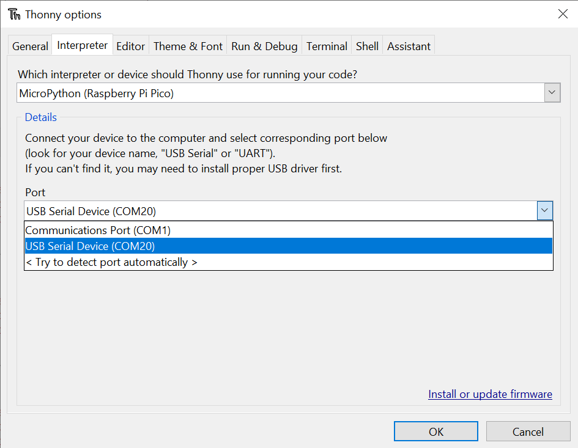

# Frequently Asked Questions (MicroPython)  <!-- omit in toc -->

- [General MicroPython](#general-micropython)
  - [How do I get pirate-brand MicroPython onto my device?](#how-do-i-get-pirate-brand-micropython-onto-my-device)
  - [I flashed MicroPython to my device and it's not showing up as a drive anymore!](#i-flashed-micropython-to-my-device-and-its-not-showing-up-as-a-drive-anymore)
  - [OK, then how do I transfer files/edit code?](#ok-then-how-do-i-transfer-filesedit-code)
  - [How do I make my code run automatically?](#how-do-i-make-my-code-run-automatically)
  - [How do I do a factory reset?](#how-do-i-do-a-factory-reset)
- [Thonny troubleshooting](#thonny-troubleshooting)
  - [I get a 'No module named 'insert Pimoroni module here' error when I try to run example code](#i-get-a-no-module-named-insert-pimoroni-module-here-error-when-i-try-to-run-example-code)
  - ['MicroPython - Raspberry Pi Pico' doesn't show up as an interpreter option](#micropython---raspberry-pi-pico-doesnt-show-up-as-an-interpreter-option)
  - [Couldn't find the device automatically?](#couldnt-find-the-device-automatically)
  - [Device is busy?](#device-is-busy)

## General MicroPython

### How do I get pirate-brand MicroPython onto my device?

Follow [these instructions!](setting-up-micropython.md)

### I flashed MicroPython to my device and it's not showing up as a drive anymore!

This is fine and expected - once your board restarts running MicroPython it will no longer show up as a drive. 

### OK, then how do I transfer files/edit code?

To program it and to transfer files to and from it you'll need to use an interpreter, such as Thonny or Mu.

- [Download Thonny](https://thonny.org/)
- [Download Mu](https://codewith.mu/)

If you're hardcore, you can also transfer files to boards running MicroPython using command line tools, like `mpremote`.

- https://docs.micropython.org/en/latest/reference/mpremote.html

To view the files on your device in Thonny you'll need to have the files window open - if you can't see it, go to 'View > Files'. Right click on a file and select 'Upload to /' or 'Download to /' to copy it to or from your board.

### How do I make my code run automatically?

Save your code as `main.py` to run it automatically when your board's powered up.

### How do I do a factory reset?

If you need to delete all your programs from your board's flash memory and start again from scratch, you can do that by downloading [this special .uf2 file](https://datasheets.raspberrypi.com/soft/flash_nuke.uf2) and copying it to your board whilst it's in bootloader mode (hold down 'bootsel', and tap 'reset'/plug in the USB cable). Once you've done that, you'll need to [install MicroPython](setting-up-micropython.md) again.

You may also find clearing the flash to be useful if you encounter problems after upgrading to the newest version of MicroPython - just make sure you save any code you've been working on to your computer first!

## Thonny troubleshooting

Having trouble getting Thonny talking to your MicroPython board? Here's some things that might help!

### I get a 'No module named 'insert Pimoroni module here' error when I try to run example code

First of all, check you downloaded and installed Pirate brand/our custom MicroPython. Standard MicroPython won't include our modules.

This error can also happen if you're trying to run code with Thonny's built in Python interpreter, instead of Pico/RP2040 flavoured MicroPython. Make sure you have 'MicroPython - Raspberry Pi Pico' selected as your interpreter in the box at the bottom right.

### 'MicroPython - Raspberry Pi Pico' doesn't show up as an interpreter option

Check you're running a recent version of Thonny - very old versions won't know what a Pico is. If you're using a Linux computer, bear in mind that some package managers don't install the most recent versions, best to download it from the [Thonny website](https://thonny.org/).

### Couldn't find the device automatically?

Some versions of Thonny seem to have problems finding devices that are running brand new Micropython v1.19. You might also run into this error if you have multiple RP2040 boards connected to your computer. To manually specify which port your device is using, click on **MicroPython (Raspberry Pi Pico)** at the bottom right, and select **Configure Interpreter**. Select your device under 'Port' - here, our board was showing up as 'COM20'.

If you're running a Windows computer, you should be able to see what COM ports your devices are using in Device Manager.

### Device is busy?

This error suggests your board is in the middle of doing something and you'll need to interrupt it by pressing the stop button in Thonny. If that doesn't get it talking, try resetting the board or disconnecting and reconnecting the USB cable. Restarting Thonny can also sometimes help!

If none of that helps, you might have a malfunctioning `main.py` - you can clear everything that's in the board's flash memory by following [these instructions](#how-do-i-get-micropython-onto-my-device). Note that this will delete the all the code saved on your device, so you should only do it as a last resort!

