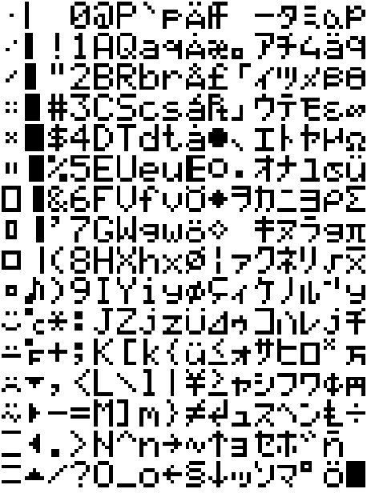

# Pico Scroll Pack - MicroPython <!-- omit in toc -->

Our Pico Scroll Pack offers a 17x7 white LED matrix for your Raspberry Pi Pico.  It also includes four buttons!

We've included helper functions to handle every aspect of drawing to the matrix and interfacing with the buttons. See the [function reference](#function-reference) for details.

- [Example Program](#example-program)
- [Function reference](#function-reference)
  - [get\_width](#get_width)
  - [get\_height](#get_height)
  - [set\_pixel](#set_pixel)
  - [set\_pixels](#set_pixels)
  - [show\_text](#show_text)
  - [scroll\_text](#scroll_text)
  - [show\_bitmap\_1d](#show_bitmap_1d)
  - [show](#show)
  - [clear](#clear)
  - [is\_pressed](#is_pressed)

## Example Program

The following example sets up the matrix, sets each pixel to an increasing brightness level, and then clears the matrix only after button A is pressed.

```python
from picoscroll import PicoScroll

# Initialise the board
picoscroll = PicoScroll()

brightness = 0

# For each pixel in the matrix
for y in range (0, picoscroll.get_height()):
  for x in range (0, picoscroll.get_width()):
    # Set that pixel to an increasing level of brightness
    picoscroll.set_pixel(x, y, brightness)
    brightness += 2

# Push the data to the matrix
picoscroll.show()

# Wait until the A button is pressed
while picoscroll.is_pressed(picoscroll.BUTTON_A) == False:
    pass

# Set the brightness of all pixels to 0
picoscroll.clear()
picoscroll.show()
```

You can now also use Scroll Pack with our tiny PicoGraphics library which has a ton of useful functions for drawing text and shapes:

- [PicoGraphics example for Scroll Pack](/micropython/examples/pico_scroll/picographics_scroll_text.py)
- [PicoGraphics function reference](/micropython/modules/picographics/README.md)
  
## Function reference

### get_width
### get_height

These return integers describing the height and width of the Scroll Pack in pixels.

```python
width_in_pixels = picoscroll.get_width()
height_in_pixels = picoscroll.get_height()
```

### set_pixel

This function sets a pixel at the `x` and `y` coordinates to a brightness level specified by the `l` parameter.  The value of `l` must be 0-255.  Changes will not be visible until `show()` is called.

```python
picoscroll.set_pixel(x, y, l)
```

### set_pixels

This function sets all pixel at once from a `bytearray` image indexed
as `y * picoscroll.get_width() + x`, containing brightness levels
between 0 and 255. Changes will not be visible until `show()` is called.

```python
image = bytearray(0 for j in range(width * height))
picoscroll.set_pixels(image)
```

### show_text

Show a text string with given brightness and offset - allowing you to
scroll text across the display. Can also be passed a `bytearray`. Font
is 5x7 pixels, with a 1 pixel space between characters, so to scroll a
phrase across the entire display involves offsets from -17 pixels to
`6 x len(str)`:

```python
word = "Hello, world!"
l = len(word) * 6
for j in range(-17, l):
    picoscroll.show_text(word, 8, j)
    picoscroll.show()
    time.sleep(0.1)
```

The full 256 characters can be displayed with:

```python
b = bytearray(range(256))
for j in range(256*6):
    picoscroll.show_text(b, 8, j)
    picoscroll.show()
    time.sleep(0.1)
```



### scroll_text

Scroll a string across the picoscroll, starting off the right hand side, to the left, with a given delay in ms.

```python
picoscroll.scroll_text("Hello, world!", 8, 100)
```

The full 256 characters can be displayed with:

```python
b = bytearray(range(256))
picoscroll.scroll_text(b, 8, 100)
```

### show_bitmap_1d

Show a view of a bitmap stored as the 7 least significant bits of
bytes in a `bytearray`, top-down. Individual pixels are set to
`brightness` based on individual bit values, with the view defined by
the offset and the width of the scroll (i.e. 17 columns). Changes will
not be visible until `show()` is called.

```python
bitmap = bytearray(j for j in range 127)
for offset in range(-17, 127):
    picoscroll.show_bitmap_1d(bitmap, 16, offset)
    picoscroll.show()
```

will scroll a binary counter across the display (i.e. show `0x00` to
`0x7f` in binary).

### show

Pushes pixel data from the Pico to the Scroll Pack.  Until this function is called any `set_pixel` or `clear` calls won't have any visible effect.

```python
picoscroll.show()
```

### clear

Sets the brightness of all pixels to `0`.  Will not visibly take effect until `show` is called.

```python
picoscroll.clear()
```

### is_pressed

Checks if a specified button is currently being pressed.  Valid values of `b` are `picoscroll.BUTTON_A`, `picoscroll.BUTTON_B`, `picoscroll.BUTTON_X`, or `picoscroll.BUTTON_Y`, which match the silkscreen labels beside the buttons on the board.

```python
picoscroll.is_pressed(b)
```
