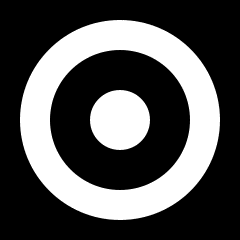

# PicoVector <!-- omit in toc -->

PicoVector is an anti-aliased vector graphics implementation built on top of PicoGraphics.

PicoVector implements bindings for [Pretty Poly](https://github.com/lowfatcode/pretty-poly) and [Alright Fonts](https://github.com/lowfatcode/alright-fonts). Providing a MicroPython interface
for building polygons and shapes, handling transformations and rendering text.

While PicoGraphics supports basic primitives like rectangles and circles, PicoVector
goes much further: allowing for arbitrary shapes with cut-outs for representing
anything from a rounded rectangle to a complex icon. Bouncing DVD logo, anyone?

- [Quick Start](#quick-start)
  - [Drawing Something](#drawing-something)
  - [Transforms](#transforms)
    - [A Note About Rotation](#a-note-about-rotation)
- [In Depth](#in-depth)
  - [Anti-aliasing Options](#anti-aliasing-options)
  - [Text, Fonts and Text Metrics](#text-fonts-and-text-metrics)
    - [Converting](#converting)
    - [Loading \& Configuring](#loading--configuring)
    - [Spacing \& Alignment](#spacing--alignment)
    - [Measuring Text](#measuring-text)
    - [Drawing Text](#drawing-text)
  - [Polygons](#polygons)
    - [Rectangle](#rectangle)
    - [Regular](#regular)
    - [Circle](#circle)
    - [Arc](#arc)
    - [Star](#star)
    - [Line](#line)
    - [Path](#path)
  - [Transformations](#transformations)
    - [T'is A-fine Day For Transformin'](#tis-a-fine-day-for-transformin)
    - [Translate](#translate)
    - [Rotate](#rotate)
    - [Scale](#scale)
    - [Custom](#custom)


## Quick Start

PicoVector wraps PicoGraphics and uses its existing pixel pushing powers to provide
pretty polygons. As such, it's super simple to set up:

```python
from picographics import PicoGraphics, YOUR_DISPLAY_TYPE
from picovector import PicoVector

graphics = PicoGraphics(YOUR_DISPLAY_TYPE)
vector = PicoVector(graphics)
```

### Drawing Something

The essential drawing primitive for PicoVector is the Polygon.

Getting your head round Polygons might be a little more complex. PicoVector uses
"Polygon" to mean a collection of one or more polygonal shapes, with subsequent
shapes either punching out or filling in areas in an "exclusive or" fashion.

For example, three concentric circles added into a "Polygon" will create an outer
donut shape from the first two circles, with the third circle appearing inside.

eg:

```python
from picovector import Polygon

bullseye = Polygon()
bullseye.circle(120, 120, 100)
bullseye.circle(120, 120, 70)
bullseye.circle(120, 120, 30)

vector.draw(bullseye)
```

### Transforms

Since PicoVector deals in Polygons, which are collections of immutable shapes,
we need some other way move them around, scale them or rotate them.

Enter Transforms:

```python
from picovector import Polygon, Transform

bullseye = Polygon()
bullseye.circle(120, 120, 100)
bullseye.circle(120, 120, 70)
bullseye.circle(120, 120, 30)

vector.set_transform(Transform().translate(100, 0))

vector.draw(bullseye)
```



A Transform is actually a 2d transformation matrix with some convenience
functions for producing common, practical transformations.

Transformation matrices are weird, and you'll find you need to reverse your
steps to get the expected results.

For example, say we want to draw a diamond in the middle of our 240x240 pixel
screen.

Since we want to move a square to the middle of the screen, and then rotate it
we might be tempted to do:

```python
vector.set_transform(Transform().translate(95, 95).rotate(45, (120, 120)))
vector.draw(Polygon().rectangle(0, 0, 50, 50))
```

Move, and then rotate. That shoul... woah why is the diamond over there!??


To understand why this doesn't work, removing the `translate()` step:

```python
vector.set_transform(Transform().rotate(45, (120, 120)))
vector.draw(Polygon().rectangle(0, 0, 50, 50))
```

puts our diamond at the top of the screen, since we have rotated our 50x50
pixel square 45 degrees around the center of the screen. It's easy to see why
translating that by `95, 95` then puts it off to the right.


The right way is to add the `translate()` last so that it happens first...
this is counter-intuitive but you'll get the hang of it after a few mishaps!

```python
vector.set_transform(Transform().rotate(45, (120, 120)).translate(95, 95))
vector.draw(Polygon().rectangle(0, 0, 50, 50))
```


Perfect!

It's worth reiterating that the same rectangle is used in all the above examples,
a plain ol' 50x50 pixel square in the top left corner of the screen. We translate
by `95, 95` because this is the screen dimension (240x240) divided by two, minus
the square size (50x50) divided by two.

Another equally valid but slightly tricky approach would be to use a square like
this:

```
Polygon().rectangle(-25, -25, 50, 50)
```

It's the same square, sort of, except it is centered on `0, 0`.

#### A Note About Rotation

To make rotation a little less confusing, the `rotate()` transform method requires
an origin, that's the tuple given as the second argument. It's an X, Y coordinate
that describes the point around which the rotation should happen.

Rotation then performs three transformations- a translation to shift to your supplied
origin, a rotation and a final translation back to its original location.

You can supply `None` if you do not want this behaviour and like to live dangerously.

## In Depth

### Anti-aliasing Options

Behind the scenes all of PicoVector's drawing is done by PicoGraphics- by
setting pixels. Unlike just directly drawing shapes with pixels PicoVector
includes anti-aliasing, a smoothing technique that turns diagonal lines
into the crisp, blended edges we'd expect from computers today.

Available options are:

* `ANTIALIAS_NONE` - turns off anti-aliasing for best performance
* `ANTIALIAS_FAST` - 4x anti-aliasing, a good balance between speed & quality
* `ANTIALIAS_BEST` - 16x anti-aliasing, best quality at the expense of speed

### Text, Fonts and Text Metrics


Under the hood PicoVector uses [Alright Fonts](https://github.com/lowfatcode/alright-fonts)
a font-format for embedded and low resource platforms.

Alright Fonts supports converting TTF and OTF fonts into .af format which can
then be displayed using PicoVector. Most of your favourite fonts should work -
including silly fonts like [Jokerman](https://en.wikipedia.org/wiki/Jokerman_(typeface)) -
but there are some limitations to their complexity.

#### Converting

Converting from an OTF or TTF font is done with the `afinate` utility. It's a 
Python script that handles decomposing the font into a simple list of points.

Right now you'll need the `port-to-c17` branch:

```
git clone https://github.com/lowfatcode/alright-fonts --branch port-to-c17
```

And you'll need to set up/activate a virtual env and install some dependencies:

```
cd alright-fonts
python3 -m venv .venv
source .venv/bin/activate
pip install freetype.py simplification
```

And, finally, convert a font with `afinate`:

```
./afinate --font jokerman.ttf --quality medium jokerman.af
```

This will output two things- a wall of text detailing which characters have
been converted and how many points/contours they consist of, and the font
file itself. You'll then need to upload the font to your board, this could
be via the file explorer in Thonny or your preferred method.

#### Loading & Configuring

```python
vector.set_font("jokerman.af", 24)
```

#### Spacing & Alignment

* `set_font_size()` 
* `set_font_word_spacing()`
* `set_font_letter_spacing()`
* `set_font_line_height()`
* `set_font_align()`

#### Measuring Text

* `x, y, w, h = measure_text(text, x=0, y=0, angle=None)`

Returns a four tuple with the x, y position, width and height in pixels.

#### Drawing Text

* `text(text, x, y, angle=None, max_width=0, max_height=0)`

When you draw text the x, y position and angle are used to create a new
Transform to control the position and rotation of your text. The transform
set with `.set_transform()` is also applied.

### Polygons

The basis of all drawing operations in PicoVector is the `Polygon` object.

A `Polygon` is a collection of one or more paths to be drawn together. This
allows for shapes with holes - letters, for example - or more complicated
designs - logos or icons - to be scaled, rotated and drawn at once.

If paths overlap then the top-most path will "punch" out the one underneath.

To use any of the primitives or path drawing methods you must first create
a `Polygon`, for example here's a simple triangle:

```python
from picovector import Polygon
my_shape = Polygon()
my_shape.path((10, 0), (0, 10), (20, 10))
```

#### Rectangle

```python
Polygon().rectangle(x, y, w, h, [corners=(tl, tr, bl, br)])
```

A rectangle is a plain old rectangular shape with optional rounded corners.

If `stroke` is greater than zero then the rectangle outline will be produced.

If any of the corner radii are greater than zero then that corner will be created.

#### Regular

```python
Polygon().regular(x, y, radius, sides, [stroke])
```

Creates a regular polygon with the given radius and number of sides. Needs at
least 3 sides (an equilateral triangle) and converges on a circle.

If `stroke` is greater than zero then the regular polygon outline will be created.

#### Circle

```python
Polygon().regular(x, y, radius, [stroke])
```

Effectively a regular polygon, approximates a circle by automatically picking
a number of sides that will look smooth for a given radius.

If `stroke` is greater than zero then the circle outline will be created.

#### Arc

```python
Polygon().arc(x, y, radius, from, to, [stroke])
```

Create an arc at x, y with radius, from and to angle (degrees).

Great for radial graphs.

If `stroke` is greater than zero then the arc outline will be created.

#### Star

```python
Polygon().star(x, y, points, inner_radius, outer_radius, [stroke])
```

Create a star at x, y with given number of points.

The inner and outer radius (in pixels) define where the points start and end.

If `stroke` is greater than zero then the arc outline will be created.

#### Line

```python
Polygon().line(x, y, x2, y2, thickness)
```

#### Path

```python
Polygon().path((x, y), (x2, y2), (x3, y3), ...)
```

A path is simply an arbitrary list of points that produce a complete closed
shape. It's ideal for drawing complex shapes such as logos or icons.

If you have a list of points you can use Python's spread operator to pass it
into `path`, eg:

```python
my_points = [(10, 0), (0, 10), (20, 10)]
my_shape = Polygon()
my_shape.path(*my_points)
```

### Transformations

To create a new empty `Transform()` you can just:

```python
my_transform = Transform()
```

And tell PicoVector it's the one you want to use with:

```python
vector.set_transform(my_transform)
```

#### T'is A-fine Day For Transformin'

Since PicoVector supports only 2D transformation matrices you can only perform
translations which are "affine." The simplest way to think about the limitations
of an affine transformation is to understand that parallel lines will remain
parallel.

You can, for example, rotate a square into a diamond since its two pairs of
parallel sides will remain parallel.

You cannot skew a square into a trapezoid, since this would require one pair of
sides to not be parallel.

#### Translate

Totally unrelated to language, a translation describes a displacement along
the X and or Y axes - or simply put: how far right and down you want a thing to
move.

For example our friend Mx. Square from above lives in the top left-hand corner:


Say we translate them by `50, 120`:

```python
vector.set_transform(Transform().translate(50, 120))
```


Away they go... hey come back we're not done yet!

#### Rotate

```python
Transform().rotate(angle_degrees, (origin_x, origin_y))
```

#### Scale

```python
Transform().scale(scale_x, scale_y)
```

#### Custom

If you want to get fancy, you can supply a custom 2d transformation matrix as a
list of nine floating point numbers. Eg:

```python
my_custom_transform = Transform().matrix([
    1.0, 0.0, 0.0,
    0.0, 1.0, 0.0,
    0.0, 0.0, 1.0
])
```

Okay, this one isn't so fancy- it's a standard "identity" matrix which has no
effect whatsoever.

What about calculating our own scale matrix?

```python
scale_x = 10
scale_y = 10

my_custom_transform = Transform().matrix([
    scale_x, 0.0, 0.0,
    0.0, scale_y, 0.0,
    0.0, 0.0, 1.0
])
```

Okay that was surprisingly easy. What about rotation, that must be hard, right?

```python
angle = math.pi / 4  # 45 degrees in radians
my_custom_transform = Transform().matrix([
    math.cos(angle), math.sin(angle), 0.0,
    -math.sin(angle), math.cos(angle), 0.0,
    0.0, 0.0, 1.0
])
```

Nope, it's pretty much just scale with bells on.