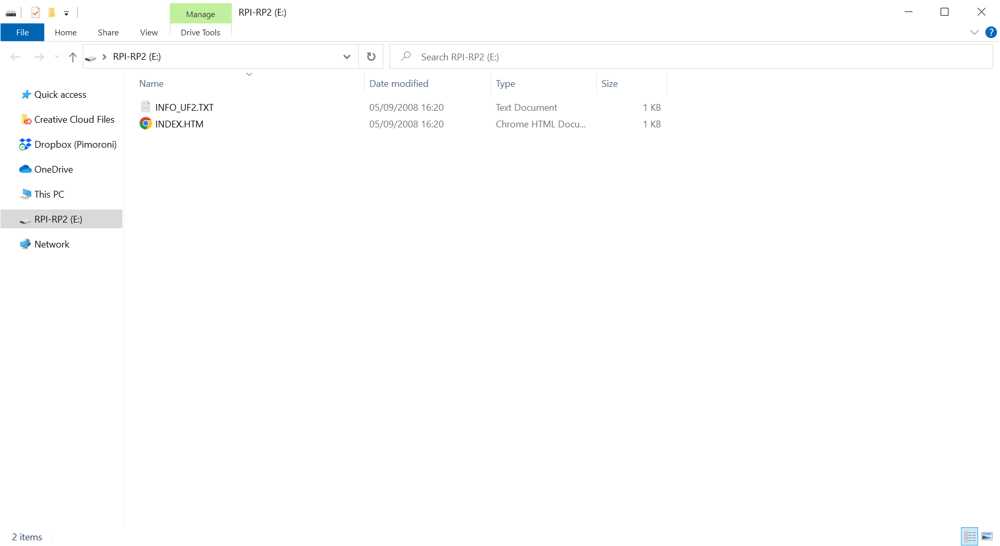

# Installing MicroPython  <!-- omit in toc -->

- [Which file to download?](#which-file-to-download)
- [Entering DFU/bootloader mode](#entering-dfubootloader-mode)
  - [If you have a board with a reset button:](#if-you-have-a-board-with-a-reset-button)
  - [If you have a board without a reset button:](#if-you-have-a-board-without-a-reset-button)
- [Copying the firmware to your board](#copying-the-firmware-to-your-board)
- [Where are the examples?](#where-are-the-examples)
- [Troubleshooting](#troubleshooting)

We provide pre-built MicroPython images which include all the drivers that include all the libraries and drivers you'll need to use our [supported products](https://github.com/pimoroni/pimoroni-pico#supported-products) To install MicroPython, you'll need to **copy the appropriate .uf2 file from the releases page to your device while it's in DFU/bootloader mode.**

## Which file to download?

On the releases page you'll find a bunch of different .uf2 files for use on different RP2040 boards (if you can't see them, click on the arrow next to 'assets' to expand the list). For Badger 2040 and Badger 2040 W you should refer to the [Badger 2040 repository](https://github.com/pimoroni/badger2040/).

- [Releases page](https://github.com/pimoroni/pimoroni-pico/releases)
- [Badger 2040 firmware](https://github.com/pimoroni/badger2040/releases)

| Board                                                        | What uf2 file to use                                         | Notes                                                        |
| ------------------------------------------------------------ | ------------------------------------------------------------ | ------------------------------------------------------------ |
| Raspberry Pi Pico and most other RP2040 boards without wireless (Plasma 2040, Interstate 75, Servo 2040, Motor 2040, Tiny 2040 2MB) | **pimoroni-pico-vx.x.x-micropython.uf2**                     |                                                              |
| Raspberry Pi Pico W and most Pico W Aboard products (Automation 2040 W, Inventor 2040 W, Plasma Stick, Interstate 75 W) | **pimoroni-picow-vx.x.x-micropython.uf2**                    |                                                              |
| Tufty 2040                                                   | **pimoroni-tufty2040-vx.x.x-micropython.uf2**                |                                                              |
| Pimoroni Pico LiPo                                           | **pimoroni-picolipo_4mb-vx.x.x-micropython.uf2** or **pimoroni-picolipo_16mb-vx.x.x-micropython.uf2** | Includes support for the increased flash memory on these boards |
| Tiny 2040 8MB                                                | **pimoroni-tiny2040-vx.x.x-micropython.uf2**                 | Includes support for the increased flash memory on this board |
| Enviro Urban, Indoor, Weather & Grow                         | **pimoroni-picow_enviro-vx.x.x-micropython.uf2**             | For a .uf2 with examples built in, go to the [Enviro releases page](https://github.com/pimoroni/enviro/releases)! |
| Galactic Unicorn                                             | **pimoroni-picow_galactic_unicorn-vx.x.x-micropython.uf2**   |                                                              |
| Inky Frame                                                   | **pimoroni-picow_inky_frame-vx.x.x-micropython.uf2**         |                                                              |
| Badger 2040 W                                                | **pimoroni-badger2040w-vx.x.x-micropython.uf2** or **pimoroni-badger2040w-v0.0.1-micropython-with-badger-os.uf2** | :warning: Badger OS will overwrite your files!
| Badger 2040                                                  | **pimoroni-badger2040-vx.x.x-micropython.uf2** or  **pimoroni-badger2040-v0.0.1-micropython-with-badger-os.uf2** | :warning: Badger OS will overwrite your files!
| Cosmic Unicorn                                               | **pimoroni-picow_cosmic_unicorn-vx.x.x-micropython.uf2**     |                                                              |
| Stellar Unicorn                                               | **pimoroni-picow_stellar_unicorn-vx.x.x-micropython.uf2**     |                                                              |

## Entering DFU/bootloader mode

### If you have a board with a reset button:

Lucky you! With your board plugged into your computer, just **hold down the BOOTSEL button and tap RESET**. A  new drive should pop up on your computer called 'RPI_RP2'. 

If your board has a power on/off button instead of a reset button, you'll need to hold down BOOTSEL and press the power button twice to cut the power, and then turn it on again.

### If you have a board without a reset button:

- **Disconnect the USB cable from your board.**
- **Press and hold the 'BOOTSEL'  button.**
- **Plug the USB cable back into your board (making sure to keep 'BOOTSEL' pressed).** A new drive should pop up on your computer called 'RPI_RP2'. 

Here's what the 'RPI-RP2' drive looks like in Windows:

## Copying the firmware to your board

**Copy the downloaded firmware image across to the 'RPI-RP2' drive**. Once it has finished uploading (which takes a few seconds) the board will restart itself.

⚠ Note that once your board restarts running MicroPython it will no longer show up as a drive. To program it and to transfer files to and from it you'll need to use an interpreter, such as Thonny or Mu.

- [Download Thonny](https://thonny.org/)
- [Download Mu](https://codewith.mu/)

You can also transfer files to boards running MicroPython using command line tools, like `mpremote`.

- https://docs.micropython.org/en/latest/reference/mpremote.html

## Where are the examples?

Note that most of our MicroPython images don't include examples, so you'll need to copy across the ones you want using Thonny. You can find all our MicroPython examples at the link below.

- [MicroPython examples](https://github.com/pimoroni/pimoroni-pico/tree/main/micropython/examples)

## Troubleshooting

Having trouble getting started? Check out the link below:

- [MicroPython FAQs](faqs-micropython.md)
